# Cloud Computing


## What is Cloud Computing {.smaller}

> Cloud computing is a model for enabling ubiquitous, convenient, on-demand network access to a shared pool of configurable computing resources (e.g., networks, servers, storage, applications, and services) that can be rapidly provisioned and released with minimal management effort or service provider interaction. 

<span class="source">National Institute of Standards and Technology (NIST) https://csrc.nist.gov/publications/detail/sp/800-145/final</span>

## Motivation 

> - **Access your R code/data** from anywhere and do your **analysis from any device**, be it a PC, tablet or even smartphone.

>- **Instantaneously augment your CPU and memory** with a click. Cheaper than buying a faster machine.  

>- Instantaneously **switch between operating systems and system configurations**. 

>- Ability to **load multiple R sessions** at once, or **parallelize your code**.

## Motivation

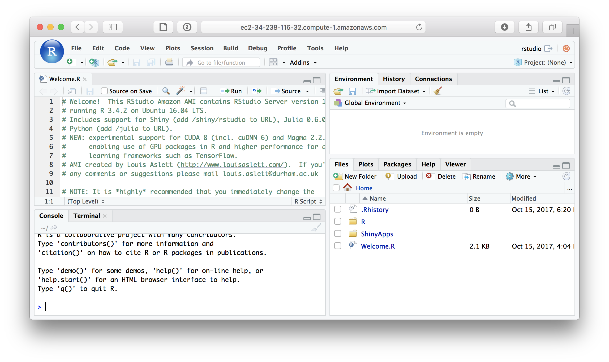

## Some Amazon Specific Terminology

**AWS: “Amazon Web Services”**. Includes all of Amazon’s cloud services. Most are actually not be needed for mere data analysis.

**EC2: “Elastic Cloud”.** The framework for running your cloud machines. This is the main service for our purposes.

**EBS: “Elastic Block Storage”.** A storage framework. If you want to attach storage to your EC2 cloud machines.

**S3: “Simple Storage Service”.** A central storage framework. If you want all your machines to read and write to a single cloud storage.

**AMI: “Amazon Machine Image”:** A snapshot of your machines’ configurations for backup and reuse on other machines.

## Create an account

Go to https://aws.amazon.com/education/awseducate/ to receive an educational account.

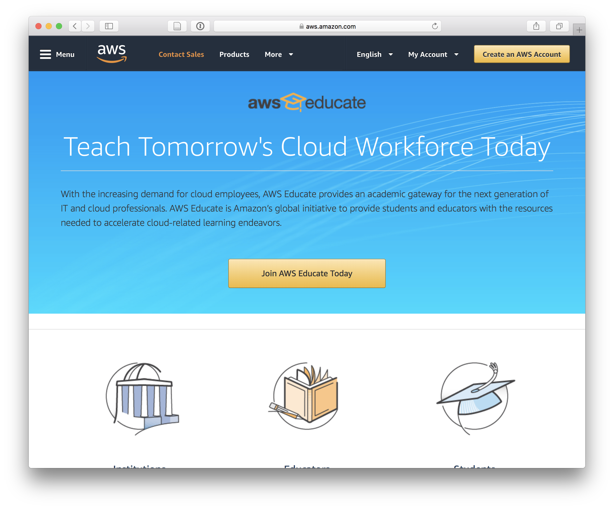

## Load an RStudio AMI

Great Pre-set Amazon Machine Images with R Studio:  http://www.louisaslett.com/RStudio_AMI/

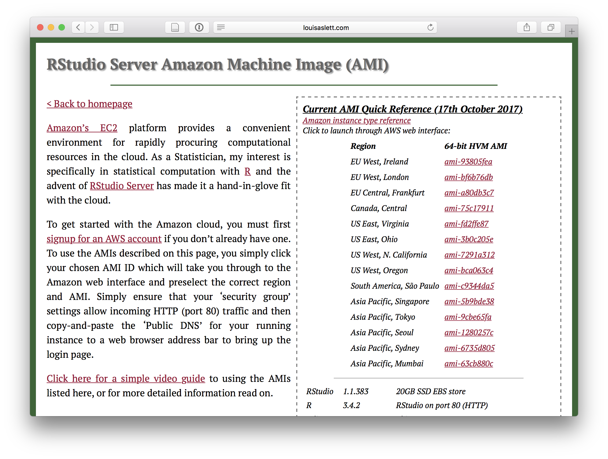

## Choose your power

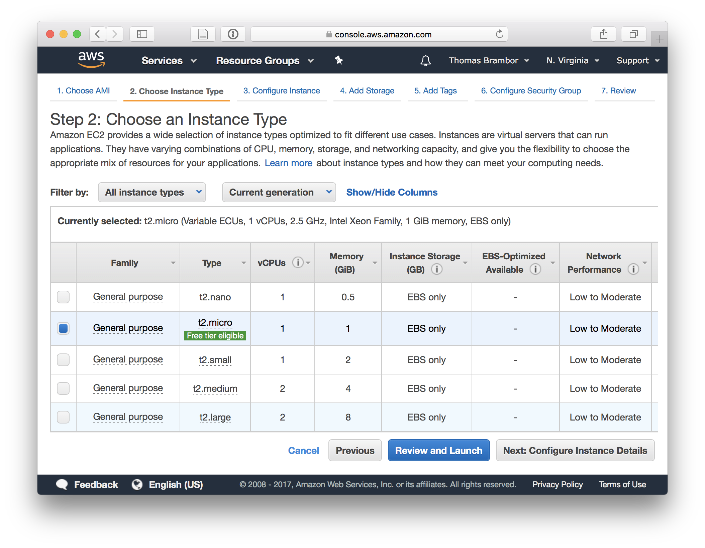

## Cost

- Running a small number of **low performance machines is pretty cheap**.  
- High performance machines can cost real money.  

## Amazon Free Tier / Educate Account

Amazon Educate / [Amazon Free](https://aws.amazon.com/free/) provides about **750 hours of computing per month for free** on a subsets of services.  

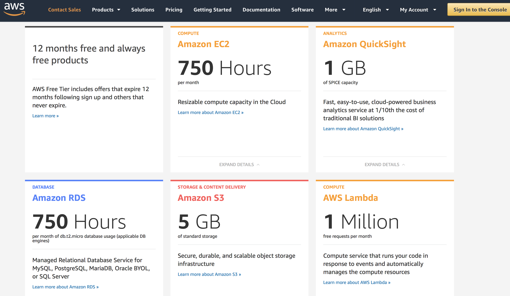

## Spot instances

Make use of [Amazon’s Spot Instances](https://aws.amazon.com/ec2/spot-instances/), for large cost reductions on non critical computations.


## Spot Instances

[Choose what you need](https://us-east-2.console.aws.amazon.com/ec2sp/v1/spot/advisor?region=us-east-2) and see the pricing.

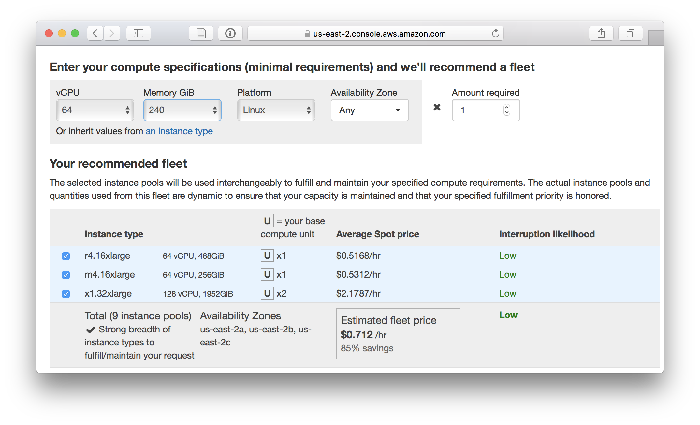

## Security Settings

Configure your security group to allow HTTP traffic from port 80 (and either all IPs or your own only for security).

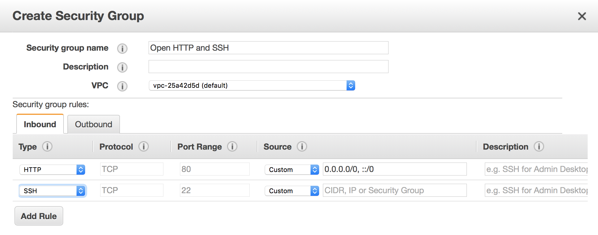

## Create a Key Pair (security measure)

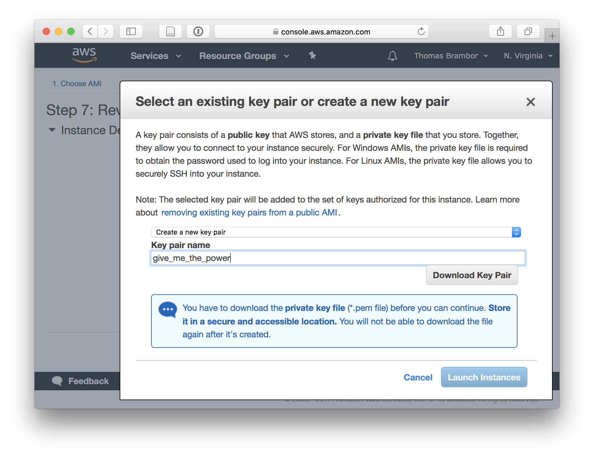

## Launch

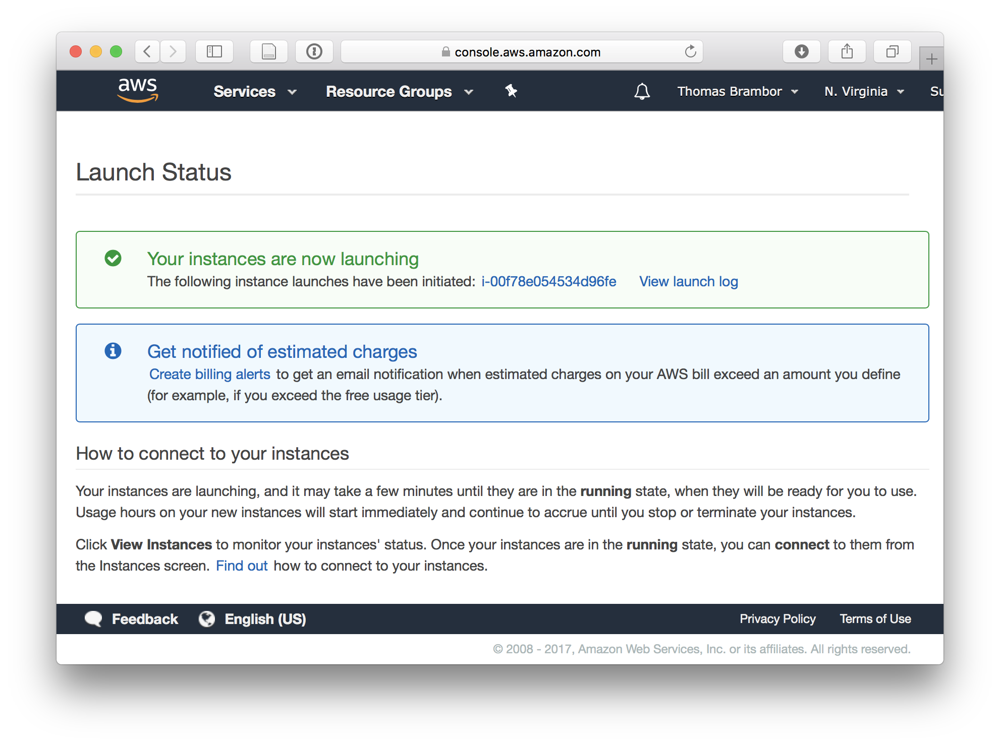

## The EC2 Console

Will take a few minutes to be ready. 

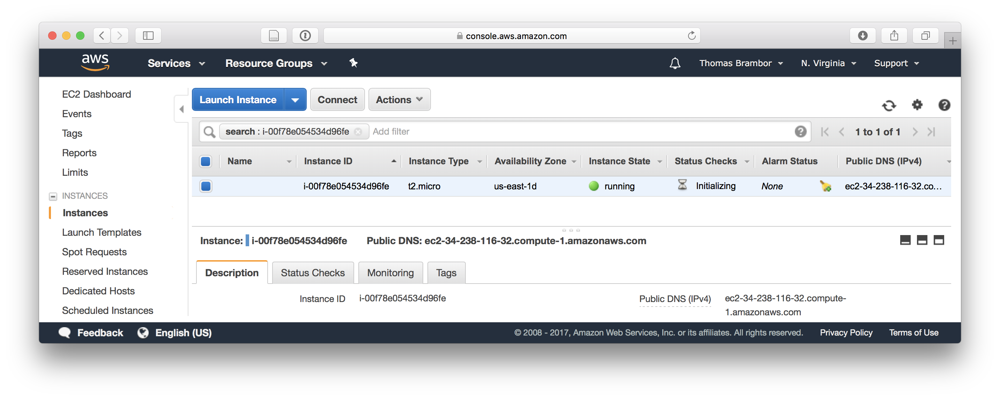

## Running R in the Cloud

Cut and paste the “Public DNS” address into your browser

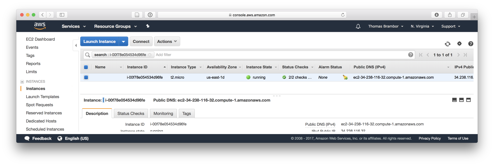

## Login

Log in: By Default the user name is set to "rstudio" and the password is your instance ID.

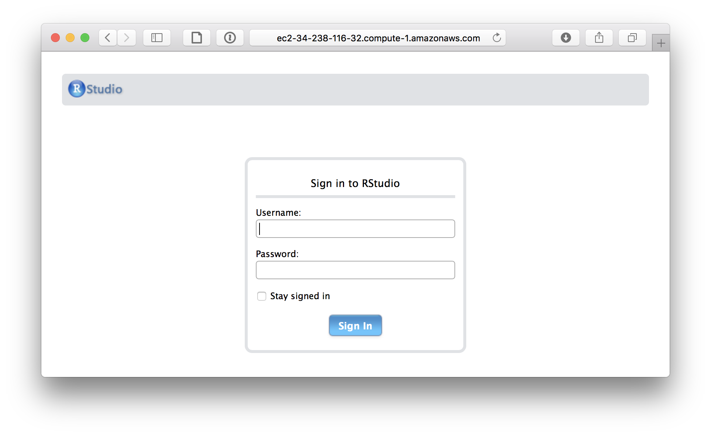

## Setup completed


## Be careful!

- Change your **password**!

- Proceed with caution when loading **sensitive data** into the cloud!

- Always **Shut down your instances!**. Otherwise you may run up a pretty bill.

## Change Password


```r
passwd()
```

## Link to Dropbox


```r
library("RStudioAMI")
linkDropbox()
```

## Selective Sync

Note, this will **initially begin syncing your entire Dropbox**. 

If this is large then it could take some time and may run out of space due to the small EC2 EBS drive space, so it is highly recommended to selectively sync just some folders. 

Use `excludeSyncDropbox()` to specify what to exclude and `includeSyncDropbox()` to include items to sync. 


```r
excludeSyncDropbox("*")           # exclude everything from syncing
includeSyncDropbox("myProject")   # Sync project folder
```

## Connect to R in the Terminal (via SSH)

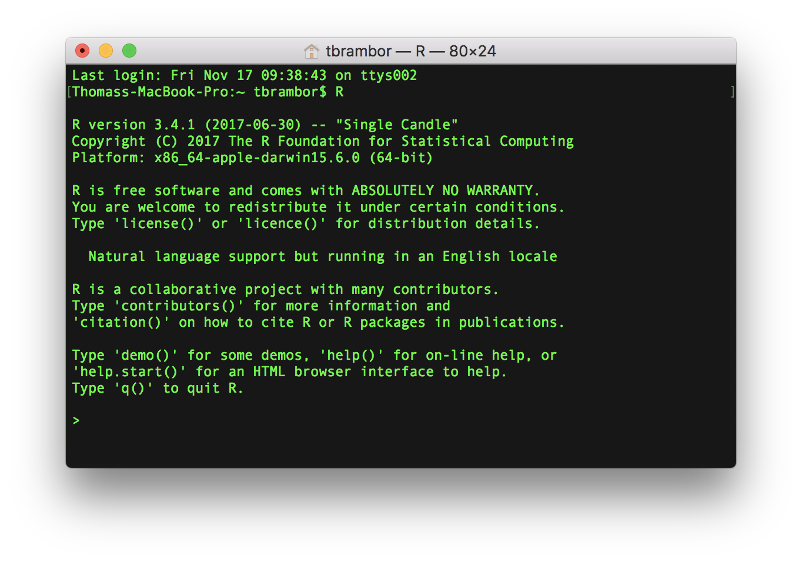

## Setup R on the AWS servers yourself

Want to decide on all your settings?

**Choosing the type of server**: https://aws.amazon.com/blogs/big-data/running-r-on-aws/

**Setup yourself:** https://aws.amazon.com/blogs/big-data/running-r-on-aws/

## Multiple computers with parallel/snow {.centered}


## Multiple computers with parallel/snow 

Extensive tutorial and material by [Jonathan Dursi](https://ljdursi.github.io/beyond-single-core-R/#/).

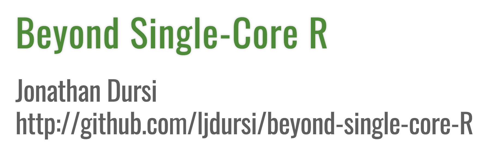

## Setting Up Your AWS Cloud Cluster

https://www.youtube.com/watch?v=YfCgK1bmCjw


## Packages

Packages are aimed at helping you starting and managing your AWS cluster: 

  - `segue`  
  - `AWS.tools`  
  - `cloudRmpi`  

## Summary

R can actually be pretty good at parallelization. But start with:

  - using your own local resources well  
  - profiling and optimizing your code  

before setting up your AWS cluster. 


## Best practices (from J.Dursi) {.smaller}

* Don't reinvent wheels  
    - Make sure to check if there are existing packages for doing your analysis in parallel.
    
* Big chunks are better than little chunks  
    - Some coarser splitting of the task may be better because you save some overhead.
    
* Parallelism gives you more compute   
    - For throwing more cores at the problem to help, the calculation has to have been limited by compute power.
    
* One task per core  
    - Compute bound calculations slow down if something else is sharing the processor with them.

* Don't trip over your own feet   
    - If you are doing four tasks at once with multicore on your laptop you are competing with yourself.
