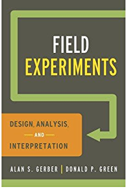

# Field Experiemnt Simulation and Randomization via R and Stata

This project is to prepare a new edition for the textbook  [*Field Experiments: Design, Analysis, and Interpretation (FEDAI)*](https://isps.yale.edu/FEDAI)  by converting the R program to Stata for all the simulations and randomization inferences in this book and problem sets.

**Affiliation**: [Institute for Social and Economic Research and Policy](http://iserp.columbia.edu/), Columbia University

**Keywords**: Randomized Controlled Trials, Simulation, Randomization Inference.

**Software**: `Stata`, `R`, `Jupyter Notebook`, `LaTex`, `Bash`

To run the script on this repository, datasets can be dowloaded from Yale University [FEDAI](https://isps.yale.edu/FEDAI) page.

#### Work Description:

1. Convert R examples in FEDAI textbook to Stata code.
2. Compile new edition solution sets integrating Stata code.
3. Convert current dataset for FEDAI solution sets to `.csv` file, since Stata `.dta` file come from different version of Stata have some compatibility problems, and coordinates the update on [FEDAI website](https://isps.yale.edu/FEDAI).
4. Compile code book for `.csv` file required in FEDAI problem sets, upload to dataverse.

### 